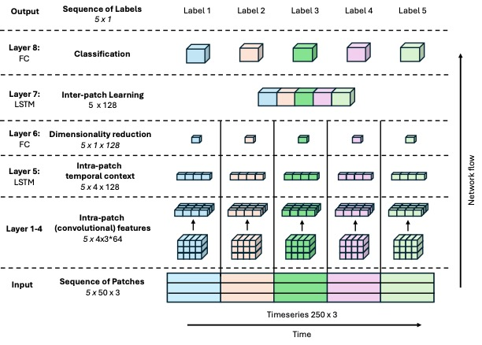

# DeepConvContext: A Multi-Scale Approach to Timeseries Classification in Human Activtiy Recognition 



## Abstract
Despite recognized limitations in modeling long-range temporal dependencies, Human Activity Recognition (HAR) has traditionally relied on a sliding window approach to segment labeled datasets. Deep learning models like DeepConvLSTM typically classify each window independently, thereby restricting learnable temporal context to within-window information. To address this constraint, we propose DeepConvContext, a multi-scale time series classification framework for HAR. Drawing inspiration from the vision-based Temporal Action Localization community, DeepConvContext models both intra- and inter-window temporal patterns by processing sequences of time-ordered windows. Unlike recent HAR models that incorporate attention mechanisms, DeepConvContext relies solely on LSTMs. Our ablation studies demonstrate the superior performance of LSTMs over attention-based variants for modeling inertial sensor data. Benchmark evaluations across six widely-used HAR datasets show that DeepConvContext achieves up to a 10% improvement in F1-score over the original DeepConvLSTM.

## Additional Results Material
Additional confusion matrices of all mentioned experiments can be found in the `confusion_matrices` folder.

## Installation
Please follow instructions mentioned in the [INSTALL.md](/INSTALL.md) file.

## Download
The datasets used for conducting experiments can be downloaded [here](https://uni-siegen.sciebo.de/s/oikTt0G8kIDZvaL).

## Reproduce Experiments
Once having installed requirements, one can rerun experiments by running the `main.py` script:

````
python main.py --config ./configs/baseline/main_experiments/deepconvcontext/hangtime_loso_lstm.yaml --seed 1
````

Each config file represents one type of experiment. Each experiment was run three times using three different random seeds (i.e. `1, 2, 3`). To rerun the experiments without changing anything about the config files, please place the complete dataset download into a folder called `data` in the main directory of the repository. The folder `job_scripts` contains collections of commands of all experiments

## Recompute metrics and figures
To recreate confusion matrices as well as compute scoring metrics mentioned in the paper, please run `compute_metrics.py`.

## Logging using Neptune.ai
In order to log experiments to [Neptune.ai](https://neptune.ai) please provide `project` and `api_token` information in your local deployment (see `main.py`)

## Contact
Marius Bock (marius.bock(at)uni-siegen.de)
